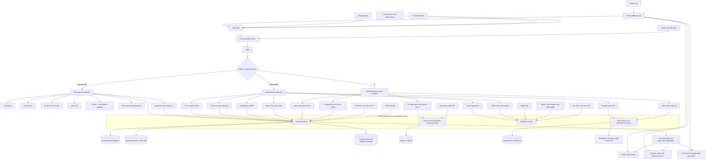
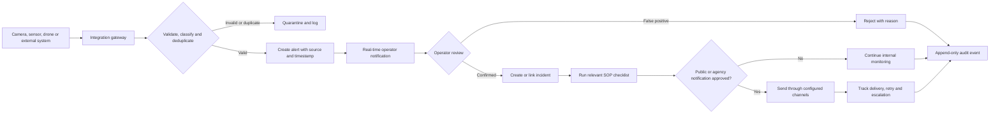

# MBDK Smart Monitoring Dashboard - Frontend Mockup Development Plan

## 0. Development status - 25 September 2026

- [x] URS reviewed end-to-end, including all embedded wireframes.
- [x] Preferred deployment topology recorded: Vercel frontend + Railway Laravel backend + Supabase PostgreSQL/PostGIS.
- [x] Laravel Cloud retained as the managed alternative.
- [x] Independent Vercel-ready React/TypeScript/Tailwind application created in `frontend/`.
- [x] Public portal, demo login/MFA, persona preview, role-aware shell, and primary responsive design system implemented.
- [x] First navigable mockup pass implemented for Dashboard Utama, Dashboard Eksekutif, CCTV, drone, traffic, disaster, GIS, parking/ANPR, Aduan, AI analytics, Smart City, and administration.
- [x] URS MBDK crest extracted from the supplied document for use as a local project asset.
- [x] Production TypeScript/Vite build passing with route-level code splitting.
- [x] Desktop and mobile browser rendering visually verified against the URS design language and information hierarchy.
- [x] Playwright end-to-end coverage added for the public portal, demo login/MFA, protected-module navigation, and role restrictions (8 browser/device checks passing).
- [ ] Remaining production-depth interactions, fixture repository interfaces, and additional loading/error/degraded states.
- [ ] Backend API, Supabase schema, authentication, queues, integrations, and real external data. These remain intentionally out of the frontend-only mockup phase.

## 1. Purpose and authority

This plan is the working reference for building a demonstration-only frontend for the **Dashboard Pemantauan Pintar MBDK**. It is based on a complete review of the 70-page URS supplied as:

- `C:\Users\Aziqtazry\Downloads\1.4 - MBDK PintarURS_Rev1.4 (1).pdf`
- URS document number: `MBDK/SEL/ET/URS/01`
- PDF creation date: 10 September 2026

Interpretation rules:

1. The user's request controls the scope: build a frontend mockup now and preserve clean integration points for a future backend, database, AI services, and cloud deployment.
2. URS functional, non-functional, integration, privacy, and role requirements are the product baseline.
3. URS screenshots are the visual wireframes. Their information hierarchy, screen density, navigation model, widgets, tables, maps, alert treatments, and interactions should be reproduced closely without copying accidental image defects.
4. When prose and screenshots differ, implement the union for the demo, record the discrepancy in Section 14, and obtain stakeholder confirmation before production implementation.
5. No real external systems, credentials, personal data, live video, AI inference, messages, or enforcement actions will be used in the mockup.
6. No code will be pushed until the user creates or selects a repository and explicitly asks for a push.

## 2. Current project baseline

- Laravel 13.32.0 / PHP 8.3
- Vite 8
- Tailwind CSS 4
- Fresh Laravel application with no production UI architecture yet
- Laravel Boost installed as required by the repository instructions
- The URS architecture image specifies a web platform with **React frontend + Laravel backend**, a central database, role-based access, an integration layer, and a Windows application platform.

### Planned frontend direction

Use React for URS architecture alignment, with TypeScript, Vite, and Tailwind CSS. Keep it in a separate `frontend/` application inside the repository so Vercel can deploy that directory independently while Railway or Laravel Cloud deploys the Laravel backend:

- React application shell and route-level screens
- typed domain models
- fixture-backed repositories/services
- one adapter boundary per future API/integration
- no database calls from UI components
- no secrets or real service URLs in frontend code

The likely production topology is now **Vercel for the React frontend, Railway for the Laravel API/backend, and Supabase for managed PostgreSQL**. Laravel Cloud remains a fully documented alternative. UI code must depend only on versioned API contracts and environment-based base URLs so changing the backend host does not require component rewrites.

The Windows application shown in the architecture diagram is not part of the first web mockup. The responsive web shell should remain suitable for a later packaged desktop client or kiosk/videowall wrapper. This boundary must be confirmed before production scope is fixed.

## 3. Definition of done for the mockup

The mockup is complete when:

- all public, authentication, operational, executive, administration, and smart-city screens in Section 7 are navigable;
- all four user perspectives can be demonstrated through a safe role-preview mechanism;
- role-specific menus and restricted actions are visibly enforced in the demo;
- every URS screenshot has a corresponding screen or state;
- maps, CCTV feeds, drone video, telemetry, alerts, sensor readings, tables, reports, and charts use clearly synthetic local data;
- primary interactions work locally: filters, tabs, dialogs, map markers, camera enlargement, alert acknowledgement, key-in forms, exports, and status changes;
- loading, empty, disconnected, stale-data, degraded, unauthorized, and critical-alert states are represented;
- desktop control-room, tablet, and minimum practical mobile/public layouts are visually verified;
- no external message, API, video, payment, enforcement, or identity action can occur;
- components consume repository/service interfaces that can later be replaced with API implementations;
- a URS traceability review confirms that no module or requirement class was omitted.

## 4. User roles and access model

| Role | Demo access | Production intent from URS |
| --- | --- | --- |
| Public user (`Pengguna Luaran`) | Public portal, selected traffic status, disaster alerts, public announcements, selected recreation/crime information | Open/anonymized data only; no recordings, identity recognition, or departmental sensitive data |
| Senior management (`Pengurusan Atasan`) | Login, landing dashboard, Executive Dashboard and reports | High-level KPIs, trends, predictive analysis, monthly reports; no technical configuration |
| Enforcement/department officer (`Penguatkuasaan`) | Login, main dashboard, CCTV, drone, traffic, disaster, GIS, parking, permitted Executive key-in screens | Monitor streams, review AI alerts, forensic search, video synopsis, update enforcement status, view analytics |
| IT administrator (`Jabatan Teknologi Maklumat`) | Login, all modules, users/RBAC, integration health, configuration, backup/restore status, audit logs | Full platform administration, AI sensitivity/ROI, server/integration health, account lifecycle |

Production authorization must be permission-based, not only role-name based. Department-specific permissions should be additive and should support least privilege.

## 5. Information architecture and planned routes

### Public and authentication

- `/` - public MBDK portal
- `/login` - staff login and demo persona preview
- `/mfa` - mocked OTP/authenticator step
- `/forgot-password` - reset-request demonstration
- `/account-locked` - three-failure lockout state

### Authenticated shell

- `/dashboard` - integrated operational landing dashboard
- `/executive` - Executive Dashboard
- `/executive/data-entry` - authorized manual data entry
- `/cctv` - CCTV grid, AI alerts, archive search
- `/cctv/:cameraId` - full camera view/playback state
- `/drone` - fleet, map, video, telemetry
- `/traffic` - traffic and smart signal monitoring
- `/disaster` - disaster monitoring and SOP workflow
- `/gis` - planning and GIS layers
- `/parking` - public-parking availability
- `/parking/anpr` - ANPR detection and validation log
- `/complaints` - `Aduan` executive tab/detail, pending confirmation
- `/ai-analytics` - the sidebar entry shown in the wireframes for AI functions/alerts
- `/smart-city` - Klang 2035 standalone Smart City module
- `/admin/users` - users and RBAC
- `/admin/system` - integration/server health and backup status
- `/admin/audit-log` - immutable audit history view

Unknown or unauthorized routes show an access-denied screen, not hidden content.

## 6. Visual system derived from the URS wireframes

### Public portal

- Light civic visual language with warm cream background, white cards, MBDK maroon, gold, and restrained status colors.
- Header with MBDK identity and `Log Masuk Kakitangan` action.
- Hero title `Selamat Datang ke Bandaraya Diraja Klang`.
- Four headline cards: population, Klang ranking, area, and establishment year.
- E-service card grid: Aduan Awam, Bayaran, Smart Parking, Smart Booking, GES/iMAPS, and Tender & Borang.
- Public monitoring section: traffic status, disaster/flood condition, and official announcements.

### Login

- Split dark screen: identity/crest panel on the left and form on the right.
- Username and password fields, MFA continuation, password reset, failure/lockout messaging.
- The role cards visible in the URS image are retained only as a clearly labelled **Demo Persona** selector. Production authentication must derive role from the identity source and never trust a self-selected role.

### Authenticated control-room shell

- Dark navy/charcoal palette with blue primary actions and cyan/green operational data.
- Persistent left sidebar, compact top status bar, main content canvas, and optional alert/context panel.
- Top bar: page title, clock/date, weather, system condition, notification indicator, profile, and logout.
- Sidebar: MBDK identity, role-filtered modules, external notification channel health, and signed-in user summary.
- Reusable cards for KPIs, charts, maps, tables, alerts, streams, telemetry, system health, and forms.
- Severity tokens are consistent across modules: critical/red, warning/amber, normal/green, information/blue, unavailable/gray.
- Dense desktop layout is the primary control-room target; tablet reflows panels; public pages have a usable mobile layout. Operator video grids may require a minimum viewport notice rather than an unusable 8x8 mobile layout.
- Accessibility target: keyboard-visible focus, semantic landmarks, labels beyond color, readable contrast, reduced-motion support, and table alternatives for charts.

## 7. Screen-by-screen implementation scope

### 7.1 Public portal and authentication - URS pp. 27-32, Figures 2-4

Build:

- portal hero, municipality statistics, e-services, public monitoring widgets, announcements, and staff login entry;
- login, mocked MFA, forgot-password, invalid credentials, account locked, inactive account, expired session, and access-denied states;
- role-aware landing and module navigation;
- UI demonstration of 15-minute timeout warning, 30-minute cooling period, and account inactivity policy;
- synthetic audit preview for successful and failed login attempts.

Future integration contracts:

- central MBDK identity directory/profile synchronization;
- MFA provider;
- login audit event API;
- immediate account lifecycle/deactivation events.

### 7.2 Integrated main dashboard - URS p. 30, Figure 4

Build:

- unified GIS map with categorized markers and layer legend;
- 2x2 CCTV preview area and emergency-alert rail;
- AI analytics summary;
- horizontal KPI strip;
- traffic trend line, complaints/category chart, compound/zone chart, disaster summary, integration status ticker;
- click-through from map markers and KPI cards to relevant module details;
- auto-refresh simulation, last-updated timestamps, pause/resume, and stale-data indication.

### 7.3 Executive Dashboard - URS pp. 32-43, Figures 5-15

Use six tabs shown in the wireframes:

1. `Populasi Penduduk` - total population, households, population density, urban/rural split, population trend, age, gender, ethnicity, income classification.
2. `Low Carbon City` - recycled waste, energy savings, green area, EV chargers, carbon-reduction trend.
3. `Smart City` - initiative totals, active domains, ISO indicator count, progress by domain.
4. `Safe City` - violence/property crime KPIs, time trend, zone/mukim comparison, hotspot cues.
5. `Aduan` - present in the image/tab count but not detailed in the prose; use clearly synthetic complaint status, category, SLA, and zone data until confirmed.
6. `Hasil & Belanja` - revenue target/actual, compound collection, operational spending, estimate-versus-actual charts.

Shared interactions:

- filter by date/year and zone;
- drill into chart details;
- export a mock report;
- manual key-in forms for authorized officers with validation, draft/reset/save confirmation, recent submissions, provenance, and approval status;
- loading/empty/integration-unavailable states with standalone/manual data fallback.

Future sources: eKompaun, SKB, Green Earth, official periodic reports, and local standalone records.

### 7.4 CCTV monitoring - URS pp. 43-47, Figures 16-17

Build:

- selectable 2x2, 3x3, 4x4, and representative 8x8 grid modes;
- filters by source, location, online state, AI alert, and camera group;
- camera cards with name, source, live/offline status, resolution, timestamp, and AI badges;
- full-view modal, mocked playback timeline, archive search by date/time/location, event tagging, snapshot/evidence state, and forensic search fields;
- AI alert pop-up with snapshot, detection type, severity, confidence, acknowledge/verify/escalate actions, and incident status;
- disconnected stream, high latency, bandwidth downgrade, and stale frame states.

Never imply that stock/demo imagery is a real MBDK live feed. Watermark all simulated feeds.

Future sources: DSS Pro and SUK Selangor using metadata APIs and RTSP/media gateway. Browsers should receive secured adaptive streaming output; credentials and raw RTSP URLs must remain server-side.

### 7.5 Drone operations - URS pp. 47-49, Figure 18

Build:

- fleet cards and selected-drone state;
- map marker, current route, completed path, coverage area, and last-known location;
- mocked live aerial video/picture-in-picture;
- telemetry for battery, altitude, speed, GPS coordinates, control signal, and mission state;
- 1 Hz visual update simulation and reconnect/stale telemetry states.

Future source: Flight Hub adapter for fleet, telemetry, flight path, and video metadata/stream authorization.

### 7.6 Traffic and smart signals - URS pp. 49-52, Figure 19

Build:

- color-coded traffic map: green/free, amber/slow, red/congested;
- KPI cards and selected-road details;
- smart-signal status table: normal, disrupted, maintenance;
- street-light status;
- six panels: traffic signals, street lights, towing, heavy vehicles, road obstructions, and gazetted information;
- anomaly alert for yellow-box blockage or unusual stopped flow;
- service/disconnected and future-controller states.

Future sources: public cameras, Waze traffic, Smart Traffic Light, Smart Street Light, gazetted-road data, and later physical signal-controller integration.

### 7.7 Disaster management - URS pp. 52-54, Figure 20

Build:

- critical/warning/normal totals;
- active alert list with source, location, threshold, time, severity, and verification state;
- affected-zone map and water-level/weather/air-quality context;
- alert detail, operator confirmation, SOP activation checklist, escalation timeline, and public-notification preview;
- notification channel selection and delivery-result simulation for SMS, WhatsApp, Telegram, and email;
- a prominent less-than-30-second target indicator for detected-to-displayed alerts;
- failed-channel/retry/degraded delivery state.

Future sources: water-level IoT sensors, CCTV flood feeds, MET Malaysia, JAS, Info Banjir JPS, Telegram Bot, WhatsApp Business, email, and SMS gateways.

### 7.8 Urban planning and GIS - URS pp. 54-56, Figure 21

Build:

- embedded-map visual shell with location/coordinate search;
- layer panel for CCTV, traffic, parking, disaster, complaints, assets, and administrative boundaries;
- marker selection, asset detail, layer opacity/visibility, legend, and hotspot overlay;
- vector/raster loading, no-access, and embedded-system-unavailable states.

Future source: GES/iMAPS plus approved base maps. Preserve spatial source, SRID, classification, freshness, and synchronization metadata.

### 7.9 Public parking and ANPR - URS pp. 56-59, Figures 22-23

Build:

- occupancy KPI cards and zone cards with capacity/available/occupied/usage state;
- selected parking-location placeholder/map;
- ANPR log table with synthetic plate, vehicle type, camera, location, timestamp, confidence, direction, and review status;
- evidence drawer, operator plate correction, accept/reject/review controls, illegal-position alert, and eKompaun submission preview;
- explicit low-confidence handling and a visible target of greater than 95% recognition accuracy without claiming the mock achieves it.

Future sources: parking sensors/video analytics, ANPR engine, vehicle cross-check, and two-way eKompaun API. Production must require human verification before an enforcement submission.

### 7.10 Administration and settings - URS pp. 59-62, Figures 24-26

Build three focused screens:

1. Users/RBAC - totals, searchable user table, add/edit/deactivate dialogs, role and granular permission assignment, status, department, last login.
2. System health - integration cards for DSS Pro, SUK CCTV, Flight Hub, GES/iMAPS, eKompaun, SKB, central identity, Waze, WhatsApp, Telegram, email, SMS, and main MBDK dashboard; latency, uptime, last check, failure state, server CPU/RAM/storage, and backup/restore status.
3. Audit log - immutable-looking append-only table, filters, original/new value detail, actor, source, IP/device, timestamp, result, correlation ID, and mock export.

Configuration screens show masked credentials only. Secret values must never be stored in frontend fixtures or returned to clients in production.

### 7.11 Standalone Smart City module - URS pp. 63-65, Figure 27

Build:

- overall Klang 2035 progress gauge;
- MS ISO 37122:2019 compliance score;
- total initiatives, domains complete, active projects, and 2035 target year;
- seven domain cards: Smart Government, Community, Living, Mobility, Economy, Environment, and Digital Infrastructure;
- phase 1/2/3 and status filters: Completed, In Progress, Planned;
- initiative detail and executive export;
- environmental sensor summary and sustainability index;
- synthetic open-data/API readiness status.

This is a standalone operational/strategic module that may share a domain service with, but is not the same screen as, the Executive Dashboard `Smart City` tab.

### 7.12 AI analytics catalogue - URS pp. 26-27 and sidebar wireframes

Provide a catalogue/status screen or drawer covering all eight required capabilities:

- virtual fencing/ROI intrusion;
- illegal parking detection;
- ANPR;
- people tracking;
- incident detection;
- abandoned object detection;
- vehicle counting;
- people counting.

Each capability shows synthetic status, configured ROI, sensitivity, last detection, confidence, related camera, and an administrator-only configuration entry. The demo does not run AI models.

## 8. Mock-data and frontend architecture

### Layers

1. **Presentation:** route screens, shared shell, widgets, dialogs, forms, charts, maps, tables.
2. **Application hooks/use cases:** dashboard composition, alert acknowledgement, filtering, report export, key-in submission, permission checks.
3. **Domain contracts:** typed users, alerts, incidents, cameras, telemetry, traffic, sensors, spatial features, parking, finance, initiatives, integrations, audit entries.
4. **Repository interfaces:** one interface per domain or bounded context.
5. **Adapters:** `Fixture...Repository` now; `Api...Repository` later.

Rules:

- fixtures live outside components and are deterministic;
- every record has a stable ID, source system, classification, observed/effective time, received time, freshness, and demo marker where relevant;
- time-based mock updates are driven by a central simulation clock so the demo can pause/reset;
- mutations operate through in-memory/local demo services, never direct component state scattered across screens;
- browser storage may retain harmless demo preferences only, never credentials, personal data, or sensitive fixtures;
- repository response shapes include data, source, freshness, sync status, and error/degraded metadata.

### Reusable component inventory

- application shell, role-aware sidebar, top status bar, breadcrumb/page header;
- KPI/stat card, status pill, severity badge, source/freshness badge;
- chart panel, map panel, layer control, legend, marker popup;
- video tile/grid, full-view dialog, playback timeline;
- alert list/card/detail, SOP checklist, delivery-channel result;
- searchable/filterable table, pagination, empty/error/loading states;
- telemetry meter, integration-health card, audit diff viewer;
- validated form controls, date/zone/source filters, confirmation dialogs;
- toast/notification center and accessible modal/drawer primitives.

## 9. Future backend architecture recommendation

Use a modular Laravel monolith first, with explicit boundaries and asynchronous integration jobs. This keeps delivery and auditing simpler than premature microservices while allowing high-volume video/AI workloads to remain separate services.

Suggested bounded contexts:

- Identity & Access
- Executive Metrics & Manual Data
- CCTV & Video Metadata
- AI Detections & Incidents
- Drone Operations
- Traffic & Mobility
- Disaster & Notifications
- GIS & Assets
- Parking & Enforcement Handoff
- Smart City Initiatives
- Integrations & Synchronization
- Audit & Compliance

### API and real-time shape

- versioned REST APIs such as `/api/v1/...` using Laravel API Resources;
- short-lived authorization for video playback; never expose VMS credentials;
- WebSocket/SSE events for alerts, integration health, telemetry, and dashboard refresh;
- Redis/Valkey-backed queues for imports, notifications, exports, AI callbacks, thumbnails, and reconciliation;
- separate critical, notifications, integrations, reports, and default queues;
- idempotency keys, correlation IDs, retry/backoff, dead-letter handling, and replay-safe consumers;
- scheduled reconciliation for every external integration plus a visible source-of-truth/freshness status;
- outbound enforcement/message operations use an outbox pattern and require authorization/approval.

Laravel Reverb is a candidate for application real-time events, and Laravel Horizon is a candidate for Redis queue monitoring. These are future decisions, not dependencies to add during the mockup.

## 10. Future database and storage recommendation

### URS-compliant baseline versus recommended change

The URS names `RDBMS/MySQL` for transaction data. MySQL 8 is therefore the strict baseline. Because the platform is heavily geospatial, the recommended production option is **PostgreSQL with PostGIS**, subject to an approved architecture/change decision. PostGIS provides geometry/geography types and spatial indexes suitable for assets, zones, flight paths, road segments, incidents, and hotspots.

Do not choose the production engine until MBDK confirms whether `MySQL` is mandatory or illustrative.

### Core relational model

Use UUID/ULID identifiers where cross-system ingestion is expected. Likely tables/bounded aggregates:

- `users`, `departments`, `roles`, `permissions`, `role_permissions`, `user_roles`, `user_permissions`, `user_sessions`, `login_attempts`, `mfa_methods`;
- `source_systems`, `integration_endpoints`, `integration_health_checks`, `sync_runs`, `webhook_receipts`, `outbox_messages`;
- `cameras`, `camera_groups`, `camera_stream_profiles`, `recording_references`, `event_tags`;
- `ai_models`, `ai_capabilities`, `regions_of_interest`, `detections`, `alert_events`, `alert_acknowledgements`, `incidents`, `incident_actions`, `evidence_items`;
- `drones`, `missions`, `telemetry_samples`, `flight_paths`;
- `road_segments`, `traffic_observations`, `traffic_anomalies`, `traffic_signals`, `street_lights`, `tow_operations`, `heavy_vehicle_events`, `road_obstructions`, `gazetted_areas`;
- `sensors`, `sensor_readings`, `threshold_rules`, `disaster_alerts`, `sop_definitions`, `sop_runs`, `notification_deliveries`;
- `spatial_layers`, `spatial_features`, `assets`, `administrative_zones`, `hotspot_snapshots`;
- `parking_zones`, `parking_facilities`, `parking_bays`, `occupancy_observations`, `anpr_detections`, `parking_violations`, `enforcement_handoffs`;
- `metric_definitions`, `metric_observations`, `manual_submissions`, `manual_submission_values`, `report_exports`;
- `smart_city_domains`, `initiatives`, `initiative_phases`, `initiative_progress`, `iso_indicators`, `compliance_scores`, `sustainability_indices`;
- `audit_events` as append-only records with actor, action, target, before/after payloads, IP/device, result, timestamp, correlation ID, and integrity hash.

### Storage rules

- relational database stores identities, permissions, structured transactions, metadata, states, and references;
- object storage stores evidence images, report files, exports, video clips/synopses, and large artifacts using encryption, retention, and signed URLs;
- the VMS remains the source of full CCTV archives where possible; do not duplicate full video into the application database;
- cache/Redis stores short-lived cache, rate limits, sessions if approved, queue payloads, and real-time fan-out state;
- high-volume telemetry and detections use time partitioning/retention; consider a dedicated time-series service only after measured load requires it;
- public/open data is generated from approved anonymized aggregates, never queried directly from restricted operational tables;
- every sensitive record carries classification, retention policy, source, lineage, and access purpose.

## 11. Cloud deployment recommendation for later

### Option A - Vercel + Railway + Supabase (current preferred direction)

- **Vercel:** deploy the `frontend/` Vite/React application with `frontend` selected as the project Root Directory. Configure SPA rewrites, preview deployments, production environment variables, CSP/security headers, and only a public API base URL. No Supabase service-role key or backend database credentials may enter the Vercel build.
- **Railway:** deploy the Laravel application from the repository root as the versioned API, integration gateway, queue producer/consumer, scheduler, notification coordinator, and audit boundary. Run web, worker, and scheduled workloads separately when production traffic warrants it.
- **Supabase:** use managed PostgreSQL as the primary transactional and spatial database, enabling PostGIS for GIS requirements. Laravel remains the default data-access and authorization boundary for restricted/ confidential information. Any direct browser use of Supabase must be limited to deliberately public or low-risk features protected by reviewed Row Level Security policies.
- **Connection strategy:** Railway is a persistent backend, so prefer the Supabase direct connection when Railway networking and the selected Supabase plan support it; otherwise use the session pooler. Reserve transaction pooling for serverless/short-lived workloads and configure Laravel connection behavior to match pooler limitations.
- **Cross-origin/security strategy:** allow only approved Vercel preview and production origins, use secure cookie/token handling, rate limiting, server-side authorization, request correlation IDs, signed media URLs, and separated secrets per environment.
- **Deployment independence:** frontend previews must be able to run against fixture mode or a staging Railway API. Database migrations are owned by the Laravel backend pipeline, not by Vercel.

This split is the leading option because it matches the company's expected platforms while preserving the URS React/Laravel architecture and the PostGIS recommendation.

### Option B - Laravel Cloud (managed Laravel alternative)

Laravel Cloud currently offers managed app compute, worker/queue clusters, MySQL or Serverless Postgres, Redis-compatible key-value storage, object storage, automatic deployments, and autoscaling options. Validate Malaysian public-sector data residency, private networking, KRISSA, procurement, audit, backup, and third-party connectivity requirements before selection.

Under this option, the React frontend may remain on Vercel or be served with the Laravel application, while Laravel Cloud replaces Railway and may also replace Supabase with its managed database. Keep the same API contracts and repository adapters so this is a deployment decision rather than an application rewrite.

### Option C - direct hyperscaler architecture

Use AWS/Azure/GCP when MBDK requires a specific Malaysian region, private links to on-premise systems, government procurement controls, custom WAF/SIEM, dedicated GPU AI inference, or deeper network isolation. Equivalent building blocks:

- load balancer + stateless Laravel web containers;
- separate worker and scheduler services;
- managed PostgreSQL/PostGIS or MySQL with multi-AZ, encryption, point-in-time recovery, and tested restores;
- managed Redis/Valkey;
- private object storage with lifecycle/WORM policies where required;
- CDN only for public/static/anonymized content;
- secrets manager and key management service;
- WebSocket/event service;
- private integration gateway/VPN to MBDK and partner systems;
- centralized logs, metrics, traces, alerting, SIEM export, and immutable audit archive;
- isolated GPU/video analytics pipeline separate from the Laravel web tier.

### Environment and security topology

- separate development, staging/UAT, and production accounts/projects;
- private database/cache networks; only the web edge is public;
- least-privilege service identities and per-integration secrets;
- encryption in transit and at rest, key rotation, WAF, rate limiting, MFA, CSP, secure headers, and dependency/image scanning;
- blue/green or rolling deployment, migration safety, automated backup, restore drills, disaster recovery objectives, and documented rollback;
- production monitoring tied to the URS SLA priorities and response targets;
- capacity tests for dashboard rendering under five seconds, CCTV latency target of one-to-two seconds, 1 Hz drone telemetry, disaster alerts under 30 seconds, 99.9% traffic monitoring availability, and ANPR target above 95%.

## 12. Delivery phases

### Phase 0 - confirmation and setup

- confirm discrepancies in Section 14;
- approve frontend dependency additions and final visual fidelity target;
- inventory usable logos, maps, photos, and video assets with rights/attribution;
- establish synthetic-data policy and demo script.

### Phase 1 - design foundation

- implement design tokens, typography, spacing, status colors, public shell, authenticated shell, navigation, responsive behavior, and accessibility primitives;
- create typed domain contracts, fixture repositories, simulation clock, permission matrix, and state patterns.

### Phase 2 - entry and overview flows

- public portal, login/MFA/lockout/session states, role preview, main integrated dashboard;
- verify role-filtered navigation and public-data restrictions.

### Phase 3 - executive and strategic screens

- Executive Dashboard six tabs, filters, charts, exports, and manual key-in;
- standalone Smart City module and AI catalogue.

### Phase 4 - operational monitoring screens

- CCTV, drone, traffic, disaster, GIS, parking/ANPR;
- connect cross-module navigation and alert/incident flows.

### Phase 5 - administration and resilience states

- users/RBAC, integration health, server/backup status, audit log;
- loading, stale, offline, partial failure, unauthorized, and recovery states.

### Phase 6 - verification and demo hardening

- URS traceability checklist;
- responsive and browser QA;
- keyboard/accessibility and contrast QA;
- production build and route smoke tests;
- visual comparison against every URS figure;
- scripted demonstrations for public, management, enforcement, and IT roles;
- document all mock-only behaviors and future API contracts.

## 13. Verification strategy

### Frontend tests

- permission matrix and route guards;
- repository adapter contracts;
- filter/calculation/formatting helpers;
- key-in form validation and reset/save behavior;
- alert acknowledgement, SOP, ANPR review, and export flows;
- stale/offline/degraded-state behavior;
- smoke tests for every route and persona.

### Visual checks

- compare each corresponding page against URS Figures 2-27;
- desktop targets: standard laptop, 1080p control-room, and wide videowall;
- tablet target for executive/field review;
- mobile target for public portal and critical summary only;
- validate chart legends, table labels, map markers, modal clipping, scroll behavior, contrast, and focus order.

### Performance demonstration checks

- production bundle builds cleanly;
- route transition and fixture rendering remain responsive;
- no uncontrolled timer/listener leaks from simulated real-time data;
- map/video placeholders lazy load;
- large CCTV grids and audit/ANPR tables use pagination or virtualization where needed.

Mockup performance does not prove production SLA compliance. SLA values must become later load, integration, failover, and observability acceptance criteria.

## 14. URS discrepancies and decisions requiring confirmation

1. The filename says Rev 1.4, PDF metadata title says Rev 1.3, and the change-control table ends at Rev 1.3. Confirm the authoritative revision.
2. Executive Dashboard says six sub-modules, but prose enumerates five. The screenshots show a sixth `Aduan` tab. Plan includes `Aduan` pending confirmation.
3. The architecture figure shows React + Laravel and a Windows app. Confirm whether the Windows client is a later deliverable or whether responsive web/kiosk mode is sufficient.
4. The login screenshot presents role cards, while the prose requires the system to derive permissions from the authenticated user. Plan treats role selection as demo-only.
5. URS transaction data references RDBMS/MySQL, while GIS requirements strongly favor PostgreSQL/PostGIS. Confirm whether MySQL is mandatory.
6. Smart City appears both inside the Executive Dashboard and as a standalone module. Plan retains both, backed later by shared data services.
7. Public-user scope mentions crime, flood, recreation, traffic, and disaster, while the portal wireframe also shows broad e-services. Confirm whether those cards deep-link to existing external services or are informational only.
8. Disaster UI/overall integration list includes SMS, WhatsApp, Telegram, and email, while its module integration subsection names only Telegram and WhatsApp. Plan displays all four as adapters, with actual enablement controlled by configuration.
9. `Pengecaman individu`/people tracking and facial-quality language create significant privacy implications. Confirm approved legal basis, retention, oversight, and whether face recognition is truly in scope; the mockup will not identify real people.
10. Manual key-in requires official output formats and source specifications from MBDK. Mock fields must be replaced only after those templates are supplied.
11. Production map provider and licensing are not final. GES/iMAPS embedding and approved base-map terms must be confirmed.
12. Exact external API contracts, network paths, rate limits, authentication, sandboxes, and owners are dependencies, not assumptions to invent.

## 15. End-to-end system flowchart

## 16. Operational alert flow

## 17. Current official references for future architecture decisions

- Laravel broadcasting and queue-backed real-time events: <https://laravel.com/framework/docs/broadcasting>
- Laravel Horizon/Redis queue monitoring: <https://laravel.com/framework/docs/horizon>
- Laravel Cloud capabilities and managed service options: <https://marketing.cloud.laravel.com/>
- PostGIS spatial data model and indexes: <https://postgis.net/docs/postgis-en.html>
- Vercel Vite deployment and monorepo root-directory setup: <https://vercel.com/docs/frameworks/frontend/vite> and <https://vercel.com/docs/monorepos>
- Railway Laravel deployment: <https://docs.railway.com/guides/laravel>
- Supabase PostgreSQL, PostGIS, RLS, and connection modes: <https://supabase.com/docs/guides/database/overview> and <https://supabase.com/docs/guides/database/connecting-to-postgres>

These links support later design decisions only. They do not authorize adding packages or selecting a production cloud/database before stakeholder approval.
